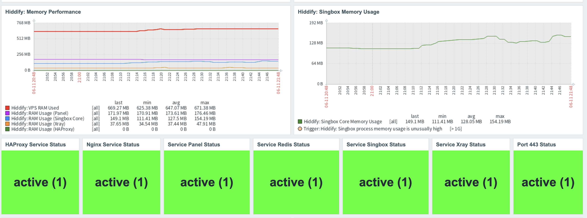
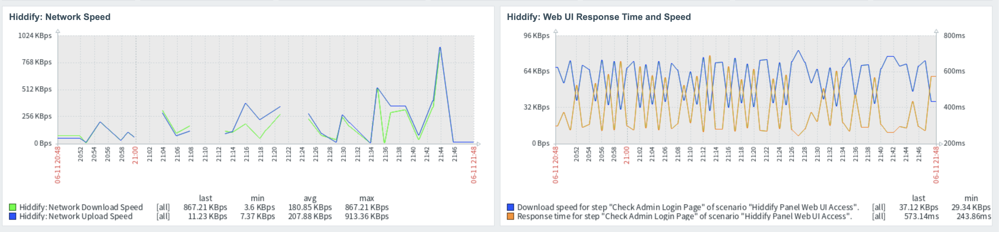

# Zabbix-Hiddify-Monitoring


Reusable Zabbix 7.4 template for deep monitoring of a VPN server powered by Hiddify Manager, its systemd core components, and client connectivity.

## What this solves

Managing modern multi-protocol VPN instances (like Hiddify) requires keeping tabs on numerous background components (Singbox, Xray, HAProxy, Nginx, Redis) simultaneously. 
Unexpected core crashes or port blocks directly disrupt client handshakes. This project provides an optimized, single-API-call Zabbix template that checks backend health, storage distribution, user metrics, and connectivity markers without introducing resource overhead.

## Project status

This project is currently under active development.
The core service tracking, user statistical items, and threshold-driven operational dashboards are fully functional. Advanced aggregate portfolio tracking for multiple VPN nodes is planned for future releases.

## Current limitations

- The user statistics depend on the responsive status of the internal Hiddify Manager API.
- Individual process tracking for Nginx or HAProxy might show negligible baseline memory allocations on empty nodes.
- High-frequency graph grids may experience minor staircase effects if data points shift slightly during long collection intervals.

## Screenshots

### Hiddify Infrastructure Overview





## Features

### Ecosystem Core Monitoring

- **Systemd service states:** Runtime binary status (`active`/`inactive`) tracking for Hiddify Panel, Singbox Core, Xray Core, Nginx, HAProxy, and Redis.
- **Edge Availability:** Live network status of the primary client connection port (`443`).
- **Web UI Latency:** Real-time monitoring of response times and webpage download speed for the Hiddify Admin interface.

### Statistical & Hardware Data

- **User Activity:** Live count of concurrent `Online Users`, accompanied by historical breakdown counters for Users Today, Yesterday, and Monthly.
- **Stacked Memory Analytics:** Granular memory usage monitoring per core process (`Singbox`, `Xray`, `Panel`, `HAProxy`) tracked against overall system memory allocation (`VPS RAM Used`).
- **Disk Allocation:** Total storage tracking alongside targeted physical path monitoring for the Hiddify Manager directory.
- **Bandwidth Metrics:** Precise network metrics capturing real-time incoming and outgoing bandwidth speeds (Download/Upload).

---

## Tested with

- Zabbix Server 7.4
- Zabbix Agent 2
- Ubuntu / Debian node running active Hiddify Manager
- Dependent items processing powered by custom JavaScript and JSONPath

---

## Repository structure

```text
zabbix-hiddify-monitoring/
├── README.md
├── configs/
│   └── hiddify_agent2.conf
├── templates/
│   └── template_hiddify_manager.yaml
└── docs/
    └── dashboard-overview.png
```

---

## Requirements

Ensure that your Zabbix Agent 2 target host has system tools configured for proper script execution, and your Zabbix profile is adjusted for clean time rendering.

### Ubuntu / Debian

```bash
sudo apt update
sudo apt install jq curl -y
```

### RHEL / CentOS / Rocky / AlmaLinux

```bash
sudo dnf install jq curl -y
```

---

## Items

The template relies on a single master item to process incoming data payloads.

---

### Dependent Core Items

| Item | Type | Key | Value type | Preprocessing |
|---|---|---|---|---|
| VPS RAM Used | Dependent | `hiddify.vps.ram.used` | Numeric unsigned | Bytes normalization |
| RAM Usage (Singbox Core) | Dependent | `hiddify.ram.singbox` | Numeric float | JSONPath extraction & `.toFixed(2)` format |
| RAM Usage (Panel) | Dependent | `hiddify.ram.panel` | Numeric float | JSONPath extraction & `.toFixed(2)` format |
| Online Users | Dependent | `hiddify.users.online` | Numeric unsigned | Axis fixed constraints definition |
| Port 443 Availability Status | Dependent | `hiddify.port443.status` | Numeric unsigned | System mapping binary adjustment |

---

## Triggers

Recommended event and performance tracking severity model:

| Range / Condition | Severity | Expression |
|---|---|---|
| Singbox core memory consumption > 1GB | Average | `last(/Template Hiddify/hiddify.ram.singbox)>1073741824` |
| Primary Client Connection Port 443 Down | High | `last(/Template Hiddify/hiddify.port443.status)=0` |
| Core Hiddify Systemd Panel Component Inactive | Disaster | `last(/Template Hiddify/hiddify.service.panel.status)=0` |

---

## Troubleshooting

### Graph displays decimal points for metric users (e.g., 4.5 users)

This occurs automatically when value fluctuations across a grid timeline remain minimal.

To override this layout:
1. Open your Dashboard view and click **Edit dashboard**.
2. Access the target widget's setup properties.
3. Switch the **Y axis MIN value** parameter from *Calculated* to **Fixed** and type `0`.
4. Save adjustments. The graph canvas will re-align to display integer steps.

### Graph legends show varying decimal digits length

Raw JSON payloads often pass floating values with mismatched precision lengths.
Ensure that each problem item has a JavaScript formatting step appended right inside its **Preprocessing** tab:

```javascript
return Number(value).toFixed(2);
```

---
## 📊 Project Stats


---
## License

This project is licensed under the MIT License. See [LICENSE](LICENSE) for details.
TL;DR: Free to use for personal and commercial projects. Attribution appreciated but not required.
